# metastorage database diagram

This diagram records every table and column currently declared in
`packages/database/src/schema`. Guest access remains future work;
Booking and Payment are introduced by issue #18.

```mermaid
erDiagram
  check_in_slots ||--o{ bookings : schedules
  users ||--o{ accounts : authenticates_with
  users ||--o{ sessions : signs_in_with
  users ||--o{ facility_assignments : receives
  facilities ||--o{ facility_assignments : has
  facilities ||--o{ facility_unit_types : offers
  unit_types ||--o{ facility_unit_types : shared_by
  facility_unit_types ||--o{ storage_units : materializes
  facility_unit_types ||--o{ reservation_drafts : selects
  facility_unit_types ||--o{ capacity_allocations : allocates
  facility_unit_types ||--o{ bookings : books
  unit_types ||--o{ storage_units : materializes
  facilities ||--o{ storage_units : contains
  facilities ||--o{ facility_operating_hours : schedules
  facilities ||--o{ reservation_drafts : receives
  unit_types ||--o{ reservation_drafts : selects
  unit_types ||--o{ capacity_allocations : allocates
  facilities ||--o{ capacity_allocations : reserves
  users o|--o{ bookings : saves_history
  users o|--o{ bookings : assigned_to
  bookings ||--o| rentals : becomes
  facilities ||--o{ rentals : hosts
  storage_units ||--o{ rentals : occupies
  bookings ||--o{ payments : records
  bookings ||--o{ booking_confirmation_emails : notifies
  bookings ||--o{ checkin_verifications : verifies
  users ||--o{ checkin_verifications : performs
  facilities ||--o{ checkin_verifications : scopes
  unit_assignments ||--o{ checkin_verifications : snapshots

  check_in_slots {
    uuid id PK
    text name
    time start_time
    time end_time
  }

  users {
    uuid id PK
    text name
    varchar email UK
    boolean email_verified
    text image
    varchar phone UK
    varchar password_hash
    role role
    status status
    timestamptz created_at
    timestamptz updated_at
  }

  accounts {
    text id PK
    uuid user_id FK
    text account_id
    text provider_id
    text access_token
    text refresh_token
    text id_token
    timestamptz access_token_expires_at
    timestamptz refresh_token_expires_at
    text scope
    text password
    timestamptz created_at
    timestamptz updated_at
  }

  sessions {
    text id PK
    uuid user_id FK
    text token UK
    timestamptz expires_at
    text ip_address
    text user_agent
    timestamptz created_at
    timestamptz updated_at
  }

  verifications {
    text id PK
    text identifier
    text value
    timestamptz expires_at
    timestamptz created_at
    timestamptz updated_at
  }

  facility_assignments {
    uuid id PK
    uuid user_id FK
    uuid facility_id FK
    timestamptz assigned_at
    timestamptz ended_at
    boolean is_active
    role role
  }

  facilities {
    uuid id PK
    varchar code UK
    varchar name
    text address
    text description
    boolean is_active
    timestamptz created_at
    timestamptz updated_at
  }

  unit_types {
    uuid id PK
    varchar code UK
    varchar name
    varchar size_label
    numeric length_m
    numeric width_m
    numeric height_m
    numeric size_cbm
    integer monthly_price
    boolean is_active
    timestamptz created_at
    timestamptz updated_at
  }

  facility_unit_types {
    uuid facility_id PK,FK
    uuid unit_type_id PK,FK
    boolean is_active
    timestamptz created_at
    timestamptz updated_at
  }

  storage_units {
    uuid id PK
    uuid facility_id FK
    uuid unit_type_id FK
    varchar code UK
    storage_unit_status status
    timestamptz created_at
    timestamptz updated_at
  }

  facility_operating_hours {
    uuid id PK
    uuid facility_id FK
    integer day_of_week
    time open_time
    time close_time
    varchar timezone
  }

  reservation_drafts {
    uuid id PK
    uuid facility_id FK
    uuid unit_type_id FK
    timestamptz check_in_at
    timestamptz rental_end_at
    integer duration_months
    varchar contact_name
    varchar contact_email
    varchar contact_phone
    reservation_draft_status status
    reservation_pricing_status pricing_status
    jsonb pricing "nullable, immutable checkout price snapshot"
    timestamptz created_at
    timestamptz updated_at
  }

  capacity_allocations {
    uuid id PK
    uuid facility_id FK
    uuid unit_type_id FK
    uuid reference_id
    capacity_allocation_kind kind
    capacity_allocation_status status
    timestamptz starts_at
    timestamptz ends_at
    timestamptz created_at
    timestamptz updated_at
  }

  bookings {
    uuid id PK
    varchar booking_code UK
    uuid user_id FK "nullable for guest; ON DELETE SET NULL"
    varchar access_token_hash "nullable"
    varchar contact_name "nullable before payment; booking-specific"
    varchar contact_email "nullable before payment; booking-specific"
    varchar contact_phone "nullable before payment; booking-specific"
    uuid facility_id FK
    uuid unit_type_id FK
    integer requested_months
    date check_in_date
    uuid check_in_slot_id FK
    timestamptz rental_end_at
    numeric monthly_rate_snapshot
    numeric rental_fee_amount
    numeric deposit_amount
    numeric total_amount
    varchar status "default DRAFT"
    uuid assigned_staff_id FK "nullable"
    varchar qr_token_hash UK
    timestamptz created_at
    timestamptz updated_at
  }

  rentals {
    uuid id PK
    uuid booking_id FK,UK
    uuid facility_id FK
    uuid physical_unit_id FK
    varchar status
    timestamptz start_at
    timestamptz expected_end_at
    timestamptz actual_return_at "nullable"
    timestamptz closed_at "nullable"
    numeric deposit_amount
    timestamptz created_at
    timestamptz updated_at
  }

  payments {
    uuid id PK
    uuid booking_id FK "nullable for legacy checkout; required in target flow"
    uuid draft_id FK "nullable; legacy checkout only"
    varchar provider
    varchar provider_payment_id
    varchar payment_code UK
    varchar hold_token_hash
    varchar idempotency_key UK
    numeric total_amount
    varchar currency
    payment_status status
    timestamptz paid_at
    timestamptz created_at
    timestamptz updated_at
  }

  payment_provider_events {
    uuid id PK
    varchar provider
    varchar provider_event_id
    uuid payment_id FK
    varchar payment_code
    numeric amount
    varchar transfer_type
    varchar reference_code
    payment_provider_event_status status
    jsonb payload_metadata
    timestamptz created_at
    timestamptz updated_at
  }

  unit_assignments {
    uuid id PK
    uuid booking_id FK
    uuid physical_unit_id FK
    uuid assigned_by FK
    varchar status
    timestamptz assigned_at
    timestamptz ended_at
    text reason
  }

  booking_confirmation_emails {
    uuid id PK
    uuid booking_id FK
    varchar recipient_email
    varchar template
    booking_email_status status
    integer attempts
    text last_error
    varchar provider_message_id
    timestamptz sent_at
    timestamptz created_at
    timestamptz updated_at
  }

  checkin_verifications {
    uuid id PK
    uuid booking_id FK
    uuid facility_id FK
    uuid staff_id FK
    uuid unit_assignment_id FK
    checkin_verification_status status
    timestamptz verified_at
    timestamptz consumed_at
    timestamptz invalidated_at
    text invalidated_reason
    timestamptz created_at
    timestamptz updated_at
  }
```

## Existing constraints and behavior

- UUID primary keys on `users`, `facilities`, `facility_assignments`,
  `unit_types`, `storage_units`, `facility_operating_hours`, `check_in_slots`, `reservation_drafts`
  and `capacity_allocations` default to generated random UUIDs. Auth tables
  `accounts`, `sessions` and `verifications` use text primary keys.
- `users.email`, `users.phone`, `facilities.code`, `storage_units.code` and
  `sessions.token` are unique. `users.phone` is nullable. Booking contact email is not unique.
- Varchar limits are `users.email` 255, `users.phone` 20,
  `users.password_hash` 255; Booking contact name/email/phone 150/320/32; `facilities.code` 50, `facilities.name` 150;
  `unit_types.code` 80, `unit_types.name` 100, `unit_types.size_label` 50;
  `storage_units.code` 80; `facility_operating_hours.timezone` 64; and
  reservation draft contact name/email/phone 150/320/32.
- Nullable columns are `users.image`, `users.phone`, `users.password_hash`,
  `users.role`, `users.status`, `bookings.user_id`, `facilities.description`,
  `facility_assignments.ended_at`, `sessions.ip_address`,
  `sessions.user_agent`, and the optional token, expiry, scope and password
  fields in `accounts`. Every other column shown is required.
- User role/status values are defined once in `packages/contracts/src/users.ts` and
  reused by Drizzle and API contracts. Changing those values still requires a database migration.
- Enum values are `role`: `CUSTOMER`, `FACILITY_STAFF`, `FACILITY_MANAGER`,
  `BUSINESS_OPERATION_MANAGER`, `SYSTEM_ADMIN`; `status`: `ACTIVE`, `INACTIVE`;
  `storage_unit_status`: `AVAILABLE`, `RESERVED`, `OCCUPIED`, `MAINTENANCE`,
  `INSPECTION`, `RETURN_PENDING`, `LOCKED`, `INACTIVE`;
  `reservation_draft_status`: `DRAFT`; `reservation_pricing_status`:
  `PRICING_NOT_CONFIGURED`, `PRICED`; `capacity_allocation_kind`: `HOLD`, `BOOKING`; and
  `capacity_allocation_status`: `ACTIVE`, `RELEASED`, `EXPIRED`.
- Composite unique indexes exist on `facility_assignments(user_id, facility_id)` and
  `facility_operating_hours(facility_id, day_of_week)`.
- Each User may work at at most one Facility at a time. A partial unique index
  `facility_assignments_active_user_idx` on `user_id WHERE is_active = true`
  enforces this rule, including concurrent assignments. Inactive assignments are
  retained. End or revoke the current assignment before assigning another Facility;
  elapsed `ended_at` rows must be deactivated before reassigning. The API does not
  automatically revoke a still-effective assignment to another Facility.
- Login through the shared API client and `GET /api/auth/me` include
  `user.assignedFacilityId`: the current assignment's Facility ID or `null`.
  Only assignments matching the User's Facility Staff/Manager role, with
  `is_active = true` and no elapsed `ended_at`, qualify. This field is derived,
  not a new column on User or Session, and does not replace backend scope checks.
- Before applying the single-Facility index migration, check for Users with
  multiple `is_active = true` assignments. Resolve them explicitly before
  migrating; the migration must not choose a Facility or discard history.
- `unit_types.code` is globally unique. `facility_unit_types` has a composite
  primary key `(facility_id, unit_type_id)` and an index on `unit_type_id`.
- `storage_units`, `bookings`, `reservation_drafts` and `capacity_allocations`
  each use a composite foreign key `(facility_id, unit_type_id)` to
  `facility_unit_types(facility_id, unit_type_id)`. `capacity_allocations.reference_id` is a UUID
  reference value without a database foreign key at this stage.
- User foreign keys use `ON DELETE CASCADE` for `accounts`, `sessions` and
  `facility_assignments`, and `ON DELETE SET NULL` for `bookings.user_id`.
  Facility foreign keys use `ON DELETE CASCADE` for `facility_unit_types`,
  `storage_units`, `facility_operating_hours` and `facility_assignments`, and
  `ON DELETE RESTRICT` for reservation drafts and capacity allocations.
  Composite Facility Unit Type foreign keys use `ON DELETE RESTRICT`.
  `facility_unit_types.unit_type_id` references `unit_types.id` with
  `ON DELETE RESTRICT`, so linked unit types cannot be deleted.
- `created_at` and `updated_at` columns default to `now()` wherever shown;
  `assigned_at` also defaults to `now()`. `facilities.is_active`,
  `unit_types.is_active`, `facility_unit_types.is_active` and
  `facility_assignments.is_active` default to true.
  `storage_units.status` defaults to `AVAILABLE`,
  `reservation_drafts.status` to `DRAFT`,
  `reservation_drafts.pricing_status` to `PRICING_NOT_CONFIGURED`, and
  `capacity_allocations.status` to `ACTIVE`. The default operating timezone is
  `Asia/Ho_Chi_Minh`.

Unit Types are a shared catalog across facilities; their definition and monthly
price are stored once in `unit_types`. Exact length, width and height are positive
decimal measurements in meters (`length_m`, `width_m`, `height_m`). `size_cbm`
is a stored generated column in cubic meters equal to `length_m * width_m * height_m`.
Catalog floor area is calculated from length and width when reading; it is not stored.
Each physical
`storage_unit` inherits these dimensions through `unit_type_id`; physical units
with different dimensions must reference different unit types. The `facility_unit_types` join table
records which facilities offer each type and can disable an offering without
disabling the shared type. Availability and capacity are scoped to the pair
`(facility_id, unit_type_id)`, never to the shared Unit Type ID alone.

For public catalog queries, a facility is eligible when it is active and has at
least one `storage_units.status = AVAILABLE` for an active shared type and active
facility offering. Unit Type availability is grouped by `unit_types.id` within
the selected facility and counts only `AVAILABLE` units. Reservation, hold and
booking flows reference the Unit Type ID; a physical unit is assigned later by
operations and is never selected by the customer.

## Guest booking and optional account history (supersedes #77/#92 Customer model)

There is no Customer table. A guest can rent without creating a User. Each Booking
owns its contact name, email and phone; equal emails do not merge contacts or grant
access to any other Booking. Contact remains on the client until payment starts.

`bookings.user_id` is nullable and references the authenticated account that saved
this Booking. Creating a Booking while signed in records the session user, never a
client-supplied user ID. Guest bookings have no account owner. Signing up, verifying
an account email, or logging in never attaches guest bookings by email. To save a
previous guest booking, the user must explicitly verify that booking and choose
“Save to account”. OTP and claim endpoints remain separate implementation work;
claim conflict behavior is TBD until that endpoint is designed.

Guest lookup uses booking code and contact email, followed by email OTP verification
before private details are returned. The resulting guest session must be short-lived
and scoped to the verified Booking. OTP expiry, retry limits, cooldown and session
TTL belong to #92; account history ownership is independent of guest access.
Deleting an account sets its Booking user IDs to NULL and preserves business history.
Payments and Rentals derive account ownership through Booking, with no duplicated
Customer or user foreign keys.

The legacy reservation/payment workflow still creates a Booking at payment success.
It now copies contact directly from that reservation draft and creates no Customer.
Its account association is not implemented; authenticated ownership is supported by
the new Booking draft endpoint, whose hold/payment consumers are still pending #113.
The project uses disposable dev data: no backfill or historical synchronization.

## Payment and Booking notes (#18)

- New checkout drafts store an immutable `pricing` snapshot: rental fee equals
  the monthly rate times the requested months; the deposit equals one month's
  rate; total equals rental fee plus deposit, in VND. Payments use this stored
  quote even if catalog prices change later. Legacy unpriced drafts must be recreated.

- Booking stores per-booking contact and pricing snapshots. All three contact fields
  are either NULL together or present together; every non-DRAFT state requires all
  three. Operational readers use these fields directly and exclude DRAFT.
- `bookings.user_id` is nullable, indexed and references users with ON DELETE SET NULL.
  It controls saved account history, not guest access. Payment and Rental have no
  customer_id columns.
- paidAt comes from the earliest non-null payments.paid_at with status SUCCEEDED
  or REFUNDED. Booking queries join slots and aggregate payments before joining,
  preventing duplicate booking rows. Other consumers retain their timestamp
  projection until their dedicated query refactors.
- Booking status defaults to DRAFT; a CHECK limits it to DRAFT, CONFIRMED,
  CANCELLED, NO_SHOW or CHECKED_IN. Pricing columns remain required.
- Bookings retain nullable unique booking_code/qr_token_hash, nullable
  assigned_staff_id and nullable access_token_hash. Operational lists/details
  exclude DRAFT; drafts cannot be assigned a unit/staff or verified through QR.
- Payment stores the transaction total, currency, provider references, status
  and paid_at; the monthly rate, rental fee and deposit breakdown belong to
  Booking. The legacy checkout obtains this breakdown from the immutable draft
  pricing snapshot when creating a confirmed Booking. Its readers project
  booking contact and date/slot timestamps for the existing API contracts.
  The payment simplification migration removes the redundant breakdown columns;
  apply it together with the compatible backend before using the checkout.
- Payment provider integration is selected through a gateway adapter. The
  current implementation provides a mock/test adapter; the production provider
  pricing policy uses the confirmed one-month deposit rule for checkout.
- A successful payment changes the matching active capacity allocation from
  `HOLD` to `BOOKING` inside the same transaction. No physical unit is assigned
  at checkout.
- `payments.idempotency_key` and `(provider, provider_payment_id)` are unique.
- `payments.draft_id` is nullable during the #113 expansion; a CHECK requires
  booking_id or draft_id. Legacy writers keep draft_id, while the target workflow
  references the DRAFT Booking from payment start. Existing booking_id FK/index
  and idempotency/provider uniqueness remain unchanged. Legacy replay still uses
  draft_id plus hold-token hash until Payment refactoring; target replay uses
  booking_id plus hold-token hash. Plaintext tokens are never stored.
- Task 2 deliberately retains reservation_drafts and its FK for current writers.
  The project is in development: existing data may be cleared and seeded again.
  No legacy-data mapping/backfill or checkout compatibility layer is required.
  Dropping the table follows the consumer refactor in the final contract phase.

Check-in slots are shared time-of-day definitions with exactly four required
columns: `id`, `name`, `start_time`, `end_time`. A Booking stores a required
`check_in_date` and `check_in_slot_id` instead of start/end timestamps. The
calendar date is interpreted in the facility timezone (currently Vietnam time).
Referenced slots cannot be deleted (`ON DELETE RESTRICT`). This change is
represented in the database by date and slot. Booking, payment, check-in and
rental readers project the start/end timestamps into existing API DTOs in
Asia/Ho_Chi_Minh time. Legacy draft requests map check_in_at to the containing
slot (start inclusive, end exclusive) and normalize draft/hold dates to that
slot's start before charging. A request outside the slots is rejected. Previously
created drafts with an unnormalized schedule must be recreated before payment.
